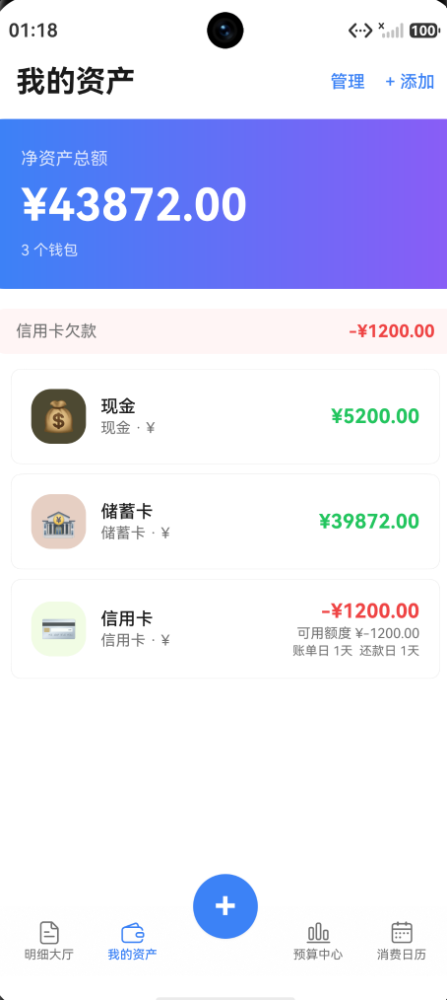
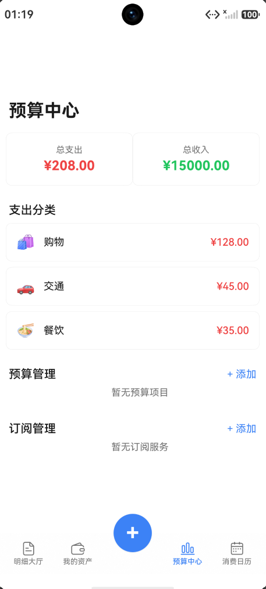
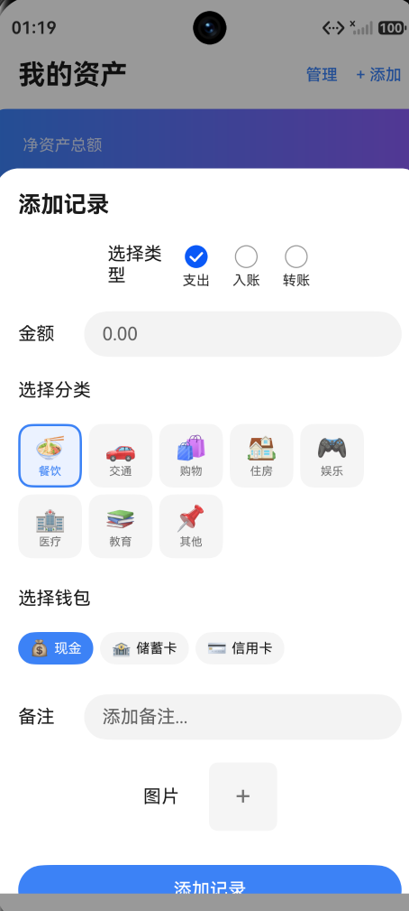
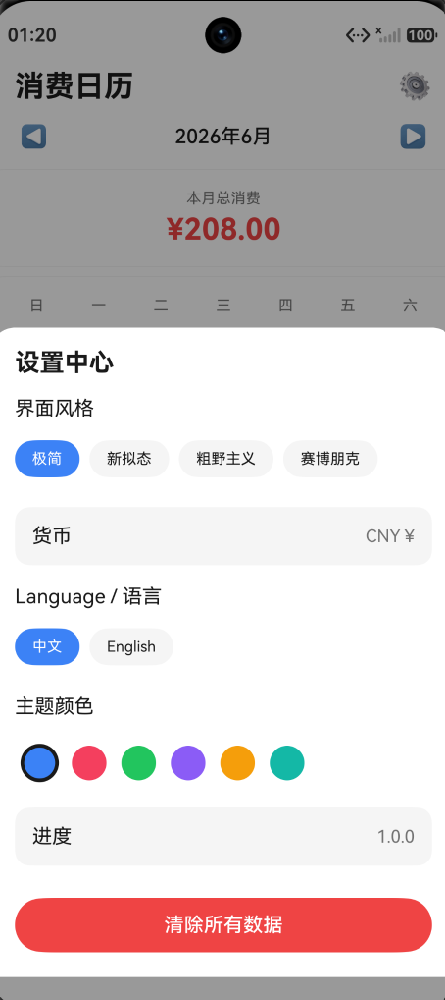

# 📊 UniTally (HarmonyOS 原生版)

UniTally 是一款专为华为鸿蒙系统 (HarmonyOS NEXT) 打造的原生双币种记账应用。本项目由 Web/TypeScript 核心版本全面迁移而来，严格基于最新的 ArkTS 语言规范与响应式声明式 UI 范式进行重构开发。

目前项目已成功跑通全量数据流闭环，并作为 **V1.0.0 核心基础大版本** 编译通过，整体逻辑功能完全可交互。

## ✨ 核心特性与功能功能演示（图文版）

应用全面采用了 "Touch n' go" 风格的底部轻量化导航设计。以下是现阶段基础版本（V1.0.0）的核心模块架构、详细功能解析以及面向未来的技术升级规划：

<table>
  <tr>
    <td width="30%" valign="top" align="center">
      
    </td>
    <td width="70%" valign="top">
      <h3>📋 明细大厅 (Book Tab)</h3>
      <strong>🔹 当前核心功能（基础版）：</strong>
      
作为日常记账与流水查阅的主阵地。系统采用高阶 List 组件，按日期键智能分组显示收支明细及当日小计。提供横向滚动的轻量化筛选 Chip 栏，支持按类型（支出/收入/转账）、分类、钱包及平台一键联动过滤。内置防抖的高性能模糊搜索，可同步对备注、分类名或钱包账户名进行多维度检索。交互上完美支持列表项的左滑触发原生删除动作与点击一键唤出编辑 Dialog。

      <strong>🚀 未来升级方向：</strong>
      <ul>
        <li><b>长列表性能暴击</b>：引入官方推荐的 <code>LazyForEach</code> 懒加载机制与自定义组件复用，将百万级海量账单滑动卡顿率降至 0。</li>
        <li><b>批量操作与动效</b>：支持长按进入多选模式，实现多条账单的批量删除或批量修改分类；引入列表项展开折叠动画，提升操作细腻度。</li>
      </ul>
    </td>
  </tr>

  <tr>
    <td width="30%" valign="top" align="center">
      
    </td>
    <td width="70%" valign="top">
      <h3>💰 我的资产 (Asset Tab)</h3>
      <strong>🔹 当前核心功能（基础版）：</strong>
      
全局资金池与个人资产净值流转中枢。顶部的资产总览卡片采用精美的蓝紫线性渐变设计，动态计算并实时渲染包含“初始余额 + 收入总额 - 支出总额”后的全局真实净资产。应用支持自由添加现金、储蓄、信用、电子钱包等多元化账户，并对信用卡类型提供针对性的可用信用额度、账单日与还款日到期提示，伴有全局欠款红条警告。支持管理模式下的长按上下移动手动排序。

      <strong>🚀 未来升级方向：</strong>
      <ul>
        <li><b>资产历史可视化</b>：引入轻量化 Canvas 资产走势折线图，直观展示近半年或近一年的净资产水位波动曲线。</li>
        <li><b>外部账单流接入</b>：通过合规的安全沙箱机制，尝试支持自动解析特定支付软件导出的账单文件或银行通知短信，实现资产半自动核对。</li>
      </ul>
    </td>
  </tr>

  <tr>
    <td width="30%" valign="top" align="center">
      
    </td>
    <td width="70%" valign="top">
      <h3>📊 数据看板 (Dashboard Tab)</h3>
      <strong>🔹 当前核心功能（基础版）：</strong>
      
深度多维度的个人财务状况透视表。提供宏观的月度收支概览卡片，并自动生成按金额由大到小倒序排列的支出分类统计列表（附带卡片阴影微调）。核心亮点在于内置了预算管理模块（带百分比进度条、超支高亮警告与超支卡片自动置顶）以及长周期的订阅服务管理功能（精确计算续费到期天数、到期预警与过期置灰提示）。

      <strong>🚀 未来升级方向：</strong>
      <ul>
        <li><b>多维交互式报表</b>：从现有的单月饼图升级为支持周/月/年多维度自由切换的动态财务报告，并引入同比与环比分析指标。</li>
        <li><b>AI 财务助手</b>：结合主流大模型能力，通过财务开销趋势为用户自动输出大语言模型（LLM）生成的个性化省钱建议与消费劣化智能预警。</li>
      </ul>
    </td>
  </tr>

  <tr>
    <td width="30%" valign="top" align="center">
      
    </td>
    <td width="70%" valign="top">
      <h3>📅 支出日历 (Calendar Tab)</h3>
      <strong>🔹 当前核心功能（基础版）：</strong>
      
将时间轴概念完美融入消费回顾。界面展现为标准的 7 列月度网格日历，通过后台状态联动，精准地将每日发生的真实支出总额高亮附着于对应日期格子下方。针对大额开销支持中文（万）与英文（k）的高级单位自适应缩写。点击特定日期格子，可在日历下方无缝联动展开并展示当天发生的详细交易流水列表。

      <strong>🚀 未来升级方向：</strong>
      <ul>
        <li><b>全局手势与热力图</b>：支持左右滑动手势进行无缝月份切换；引入类似 GitHub Contribution Graph 的消费热力图模式，一眼洞察消费密集期。</li>
        <li><b>日历快捷记账</b>：支持双击或长按某一个日历格子，直接跳转到记账页面，并自动将其日期字段初始化为当前选中的特殊日期。</li>
      </ul>
    </td>
  </tr>

  <tr>
    <td width="30%" valign="top" align="center">
      
    </td>
    <td width="70%" valign="top">
      <h3>🌍 高阶弹窗与多币种流转</h3>
      <strong>🔹 当前核心功能（基础版）：</strong>
      
全表单操作皆由高性能的 <code>NavDestinationMode.DIALOG</code> 模式路由页面承载，确保视图层叠关系的极致平滑。针对经常流转于多国生活、留学的跨国用户场景，系统完美支持人民币 (RMB) 与令吉 (RM) 的资产交互。在同币种下展现为极简单金额输入；<b>一旦系统检测到转出账户与转入账户币种不同，表单将自动触发动态横向展开，变更为“跨币种双金额输入模式”</b>，并呈现高精度的实时汇率缓存提示。在数据底层，由于“转账”本身属于资产迁移而非实际消费，这类记录会被完美剔除出总消费统计，捍卫财务数据的红线准确性。支持相册图片凭证附件上传。

      <strong>🚀 未来升级方向：</strong>
      <ul>
        <li><b>外汇实时同步</b>：接入线上公网外汇 API，实现主要国际货币汇率的秒级自动更新与本地定时缓存刷新。</li>
        <li><b>相机/发票 OCR</b>：支持调用手机系统相机直接拍摄购物小票，利用 OCR 技术自动提取金额、商家和日期，实现智能秒速填表。</li>
      </ul>
    </td>
  </tr>

  <tr>
    <td width="30%" valign="top" align="center">
      
    </td>
    <td width="70%" valign="top">
      <h3>🎨 多语言与多主题个性化引擎</h3>
      <strong>🔹 当前核心功能（基础版）：</strong>
      
为应用提供核心的系统级配置保障。代码基于 <code>AppStorage</code> 与 <code>@ohos.data.preferences</code> 的高度结合，实现了完全断网可用的多国语言一键切换（中文 / English 全局UI覆盖）。系统内置了完整的个性化样式渲染引擎，允许用户在“极简 (Minimalist) / 新拟态 (Neumorphism) / 粗野主义 (Brutalism) / 赛博朋克 (Cyberpunk)”四种差异极大的视觉风格间动态热切换（全套重写圆角、卡片阴影、边框线条与前景遮罩层），并提供 6 种高饱和度主题色调供自由指定。提供本地存储一键清除与数据重置按钮。

      <strong>🚀 未来升级方向：</strong>
      <ul>
        <li><b>深色模式智能跟随</b>：全面重构主题色映射表，支持根据鸿蒙系统底层的深色模式（Dark Mode）进行无缝的环境色彩自动演变。</li>
        <li><b>云端同步与多端备份</b>：引入云仓存储机制（如 Supabase 或华为云空间空间仓），在坚持本地优先的原则下，为用户多设备数据流转与备份提供底座支持。</li>
      </ul>
    </td>
  </tr>
</table>

## 🛠️ 技术架构亮点与工程问题攻坚

在迁移到 HarmonyOS 原生平台的过程中，本项目严格遵循官方最新标准，攻克了声明式 UI 下的多项数据同步与渲染难题：

* **完全避坑覆盖层错乱**：在重构早期，原先基于 `CustomDialogController` 的全局悬浮弹窗容易导致系统主线程在复杂组件渲染下产生短暂阻塞或覆盖层错乱白屏。本项目全面推翻重写，利用官方主推的 `Navigation` 组件，将“记账/编辑/设置”全量重构为 `NavDestinationMode.DIALOG` 页面。所有弹窗均拥有独立的生命周期，层级关系清晰，滑动阻尼流畅度达到丝滑水准。
* **多层级状态的高效响应**：项目依托单向数据流与全局状态总线设计。`Index.ets` 作为最高数据源持有全局 `@Provide` 响应式数组（交易、钱包、预算、订阅等列表），各类编辑 DIALOG 以及底层子组件通过 `@Consume` 直接精准接收、双向绑定并逆向驱动。
* **O(1) 渲染开销控制**：为严防在复杂界面重build时触发高频的“全量数据循环遍历”，应用在 `Index.ets` 中构建了完善的业务缓存区（包括 `walletBalanceCache` 动态余额缓存、`budgetSpentCache` 预算花费缓存、月度消费及日历格子缓存）。在 `@Watch` 的精确调度下，只有在数据真正更新时才会局部重新生成缓存。前台 UI 组件的渲染提取直接从缓存中按键名（Key）读取，时间复杂度被牢牢压死在 $O(1)$，绝不占用宝贵的渲染帧时间。
* **健壮的反序列化保护**：代码在处理本地持久化 JSON 数据反序列化时，彻底去除了 `any` 和 `unknown` 等不安全类型，严格采用 `as Object[]` 或 `as Record<string, Object>` 等显式断言。配合专门封装的 `createTransactionFromJson` 等工厂方法进行强类型构建，彻底绝育了运行时因字段缺失导致的 App Crash。

## 🚀 快速启动与构建指导

1.  克隆本项目到本地 HarmonyOS 开发环境中。
2.  确保您的环境已安装最新的 **DevEco Studio 6.1.1**（或更高版本）以及 HarmonyOS SDK (API 12)。
3.  使用 IDE 打开项目根目录，Hvigor 构建工具将会自动读取 `oh-package.json5` 并无缝同步下载相关内部库依赖。
4.  连接您的真机设备（需开启开发者模式）或打开华为鸿蒙官方模拟器。
5.  点击 `Run` 按钮开始本地编译、签名并推送运行。
    * *注：若控制台抛出 `hvigor WARN: Will skip sign 'hos_hap'` 的未配置证书签名警告，属于正常现象，直接忽略即可，不影响本地 Debug 调试与实际交互体验。*

## 📄 开源协议
本项目采用 [MIT License](LICENSE) 开源协议，所有底层代码均可自由修改或用于学习交流。
